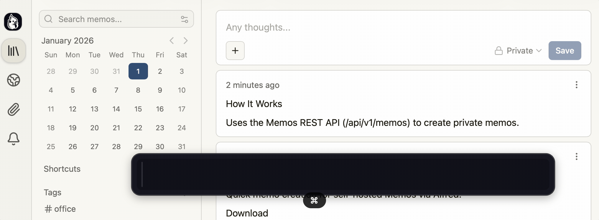

# Memos Alfred Workflow

Quick memo creation for self-hosted [Memos](https://usememos.com) via Alfred.

## Download

[Download latest release](https://github.com/shensquared/alfred-memos-workflow/releases/latest)

## Usage

```
m your memo text here
```



## Installation

1. Download and double-click `Memos.alfredworkflow` to install
2. Configure the workflow variables:
   - `MEMOS_TOKEN` - Access token from Memos Settings
   - `MEMOS_URL` - Your Memos instance URL

## Configuration

| Variable | Required | Default | Description |
|----------|----------|---------|-------------|
| `MEMOS_TOKEN` | Yes | - | Access token from Memos |
| `MEMOS_URL` | Yes | - | Your Memos instance URL (e.g., `http://localhost:5230`) |

## How It Works

Uses the Memos REST API (`/api/v1/memos`) to create private memos.

## Requirements

- Alfred with Powerpack
- `curl` (included in macOS)
